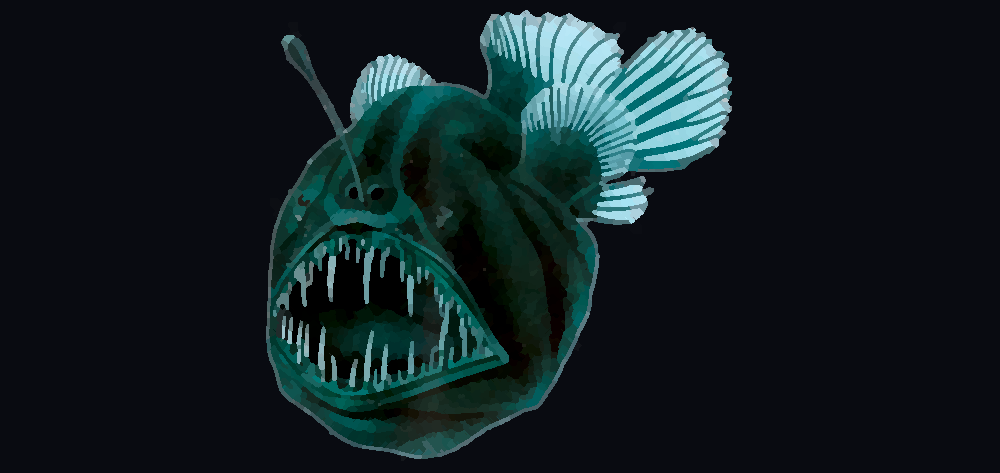

# [angler](https://en.wikipedia.org/wiki/Angling).[fish](https://en.wikipedia.org/wiki/Anglerfish)

A collection of (mostly) disconnected small `fish` shell programs for avid anglers.


> Image: Average fish user

## Programs

### [Fgit](/fgit)
A simple git CLI
### [FishFinder](/fishfinder)
TUI file explorer
### [FishFish](/fishfish)
Fish in fish
### [Games](/games)
Games written in fish
### [LLM](/llm)
An LLM interface
### [Reel](/reel)
Fuzzy package manager
### [Rod](/rod)
Change your fish prompt
### [TackleBox](/tbox)
TUI fuzzy finding launcher
### [Vest](/vest)
A "curated history" fuzzy finder

## Demo

Use `tbox` to load a TUI that can launch these programs:
```sh
./angler.fish
```

## Aliases

You can add aliases for most of the useful programs here by running:

```sh
source angler.alias.fish
```

> [!TIP]
> Use the `:alias` alias to list all angler aliases.
> 
> You can also use `:alias` to set new angler style aliases


> [!WARNING]
> You must be inside a `fish` shell to source these aliases.
