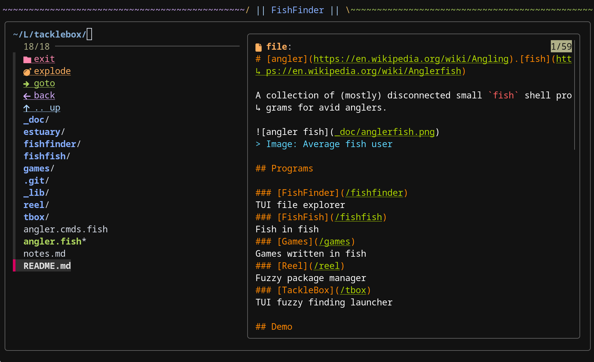

# FishFinder

FishFinder is a terminal file explorer with fuzzy searching using fzf.



## Requires

- `fzf` 
- `../_lib/input.fish` 

> [!TIP]
> This tool will try to use `bat` or `batcat` to preview files if installed. If neither can be found it falls back to `cat`.

## Parameters

You can enter a special mode by sending an argument to fishfinder
- `no argument`: Normal mode, shows files and directories
- `explode, e `: Shows all files recursively from current directory
- `last, l    `: Last path mode, echoes the last selected path from fishfinder and exits
- `minimal, m `: Dont show TUI options (keybinds only mode)
- `hidden, h  `: Show hidden files

> [!TIP]
> These parameters can be combined and passed in any order.

> [!TIP]
> When this program exits it will write a temporary file that contains the last selected path.
> You can retrieve this path with `fishfinder l`:
> ```sh
> ./finder.fish
> cd (./finder.fish l)
> ```

## Keybinds

### Default keybinds

The default keybinds are as follows. See the "Action Map" below for more info.

```txt
# Keybindings for FishFinder custom actions are suffixed `:` (colon)
kb up: left
kb up: ctrl-u
kb hidden: ctrl-a
kb explode: ctrl-x
kb view: ctrl-v
kb goto: ctrl-g
kb last: ctrl-l
kb print: ctrl-p
kb exec: ctrl-e
kb open: ctrl-o
kb copy: ctrl-y
kb del: ctrl-d
kb delquick: alt-d
kb reload: ctrl-r
kb cmd: ':'

# We can also use ANY valid fzf action!
kb accept enter
kb accept right
kb preview-up alt-k
kb preview-down alt-j
kb toggle-preview alt-h
```

> [!TIP]
> This tool inherits your default `fzf` keybinds unless they are remapped.
> 
> This means by default you have:
> 
> `enter     `: Enter directory or select file (accept)
> 
> `shift-up  `: Scroll preview up
> 
> `shift-down`: Scroll preview down
> 
> `ctrl-q    `: Quit


### FishFinder Actions Map

- `up:      `: Move up one dir (cd ..)
- `explode: `: Set explode mode (show all files recursively from current directory)
- `view:    `: Just view the file
- `goto:    `: Go to a specific directory
- `last:    `: Go to the last directory (cd -)
- `print:   `: Print the selected file path and exit
- `exec:    `: Execute the selected file
- `open:    `: Open file or directory in GUI (open / xdg-open)
- `copy:    `: Copy the selected path to the system clipboard
- `del:     `: Delete the selected file or directory with confirmation
- `delquick:`: Instantly delete the selected file or directory
- `reload:  `: Reload the current directory listing
- `cmd:     `: Execute a custom command on the selected file or directory
- `hidden:  `: Toggle showing hidden files

> [!NOTE]
> FishFinder actions are suffixed with a `:` (colon).

### Custom Keybinds

You can set a `FF_KB` environmental variable with a path to a `keybinds.fish` file.

This file should contain a set of `kb` commands with this syntax:
```fish
kb [action] [key]
```

For example:
```sh
kb goto ctrl-d
```

> [!WARNING]
> `ctrl-h` is treated as backspace by most terms
> 
> `ctrl-b` is used by tmux 

> [!TIP]
> You can use any valid [fzf action](https://www.mankier.com/1/fzf#Key/Event_Bindings-Available_Actions) here in addition to the FishFinder actions. The `fzf` actions are NOT suffixed with a `:` (colon). 

> [!TIP]
> See [fzf man page](https://www.mankier.com/1/fzf#Key/Event_Bindings-Available_Keys:_(Synonyms)) for a list of valid keys.

> [!TIP]
> See the ['./keybinds.fish'](./keybinds.fish) file for keybind examples. 

> [!TIP]
> You can bind the same action multiple times but a given key should only map to one action.

## Todo
- Save position & query when reloading
- Improve reload speed
- Support multi-select
- Select dir and exit command
- Edit dir command
