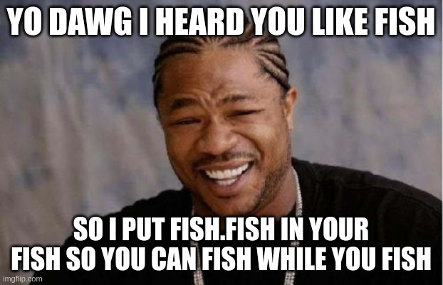

# Fish FIsh

Prints a random fish name and description

# Requires
- `../lib/dict.fish`

- Use `--no-greet` to supress the greeting graphics
- The fish list is sourced from Wikipedia
    - So all fish names are real
- Descriptions are generated by LLM and may be nonsensical or inaccurate
