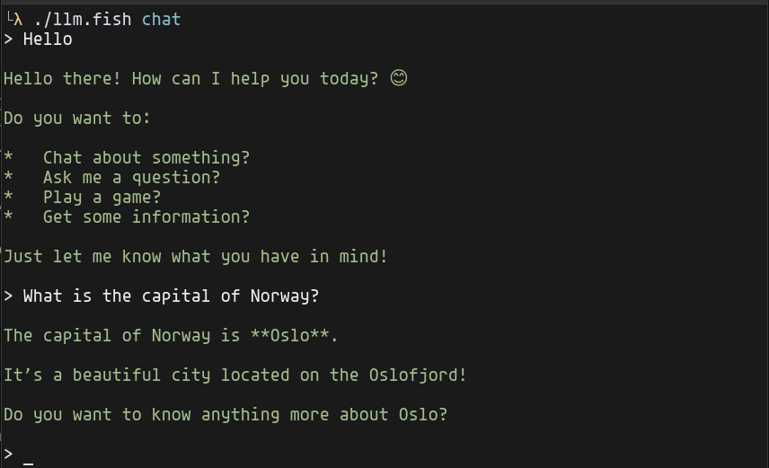

# LLM
A fish interface for interacting with LLMs.



## Supports
- Ollama
- More later?

## Config
On first run this app will create a file at `~/.config/fish/llm.cfg.fish` and exit. 

Edit this file as needed to set your endpoint and desired model. 

## Usage

### Syntax
```sh
./llm.fish [cmd] [prompt ...]
```

### Example
```sh
./llm.fish com tell me a joke
```

### Commands
- `com ` - A simple one-time completion
- `cmd ` - Describe a unix command and the LLM will respond with a command example
- `chat` - Enter a chat with the LLM

> [!TIP]
> You will need to wrap your prompt in parenthesis if it contains reserved characters like (`?`). 
