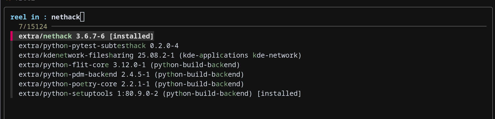

# Reel 

Install packages with fuzzy search via fzf.

## Requires
- `fzf`

## Supports
- `pacman`
- `dnf`
- `apt`

Never automatically installs the package

The high-level process here is:

1) search - Search for a package and filter results onto one line.
  Sometimes we also need to filter out extra metadata from the package manager
2) filter - Filter the selected package info down to just the name
3) install - Install the target package

